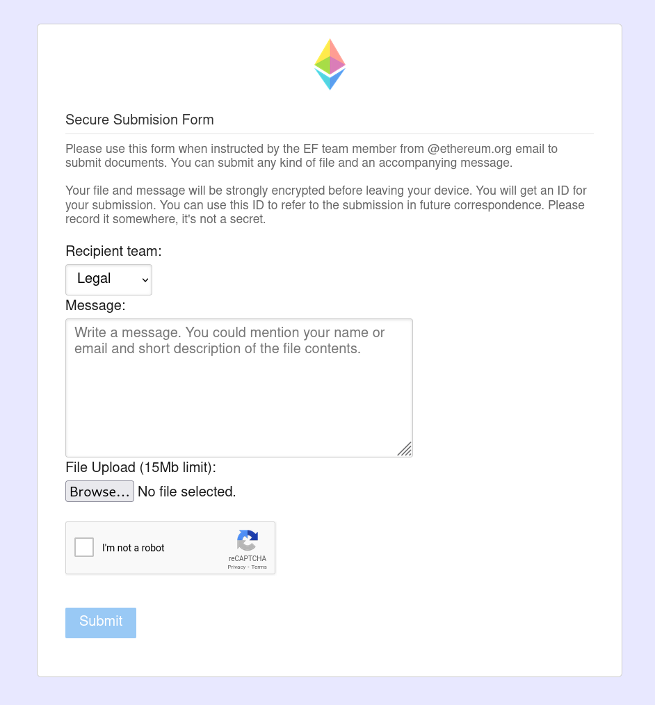

# Secure Drop

Secure-drop provides a way for users to securely, using browser-side PGP encryption on the client, submit files and/or messages to specified recipients in the Ethereum Foundation via a [web form](https://secure-drop.ethereum.org/).


## User flow

1. User writes a message and may select files for a selected recipient.
2. The user's browser encrypts the content using [OpenPGP.js](https://openpgpjs.org/) with a public key of the recipient, before submitting the encrypted content to the server.
3. The server uses its email delivery service to send the email to the intended recipient.
4. The recipient receives the encrypted message/file, and can then decrypt it using their private PGP key.


## Dependencies

Docker Compose.


### Third Party Services

* AWS SES (for email delivery)
* Cloudflare Turnstile (for bot protection)
* Kissflow API (optional - for KYC submission tracking)


## New setup

Make a fork of the repository. Set environment variables in `.env` file, using the provided example. Customise the templates and code. Update public keys in [static/js/public-keys.js](static/js/public-keys.js). Deploy to your web server or K8s cluster.

### Kissflow Integration (Optional)

The application now supports automatic integration with Kissflow for KYC submission tracking. When enabled, legal submissions with a Grant ID will automatically update the corresponding AOG (Approval of Grants) item in Kissflow with the submission identifier.

To enable Kissflow integration:
1. Add the following to your `.env` file:
   ```
   KISSFLOW_API_KEY=your_api_key
   KISSFLOW_ACCOUNT_ID=your_account_id
   KISSFLOW_PROCESS_ID=your_aog_process_id
   ```
2. Ensure your Kissflow API has permissions to read and update AOG items
3. Test the integration using `python test_kissflow_integration.py`

## Security

If the server running the service were to be compromised, this could lead to severe issues such as public keys and email addresses being changed/added so that an attacker can also read the encrypted messages.

A server operator should follow best practises for security when setting up and operating the server running the service.


## Run
```
docker compose up
```

The server will be listening on 4200 port.
