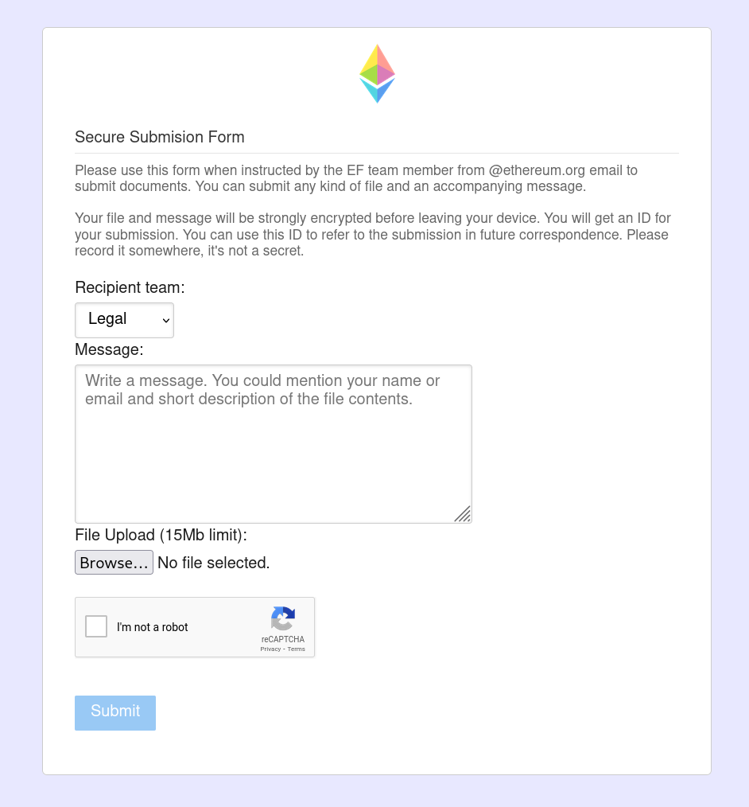

# Secure Drop

Secure-drop provides a way for users to securely, using browser-side PGP encryption on the client, submit files and/or messages to specified recipients in the Ethereum Foundation via a [web form](https://secure-drop.ethereum.org/).


## User flow

1. User writes a message and may select files for a selected recipient.
2. The user's browser encrypts the content using [OpenPGP.js](https://openpgpjs.org/) with a public key of the recipient, before submitting the encrypted content to the server.
3. The server uses its email delivery service to send the email to the intended recipient.
4. The recipient receives the encrypted message/file, and can then decrypt it using their private PGP key.


## Dependencies

Docker Compose.


### Third Party Services

* AWS SES (for email delivery)
* Cloudflare Turnstile (for bot protection)
* Kissflow API (optional - for KYC submission tracking)
* zkPassport (optional passport verification for Legal submissions, see below). The pieces involved: the zkPassport mobile app on the applicant's phone, zkPassport's end-to-end encrypted bridge relay that carries the proof from the phone to the browser, a per-domain config lookup the browser SDK makes against zkPassport's dashboard API, zkPassport's circuits CDN and an Ethereum RPC (currently the SDK's built-in Alchemy key) that the verifier reads during verification.


## New setup

Make a fork of the repository. Set environment variables in `.env` file, using the provided example. Customise the templates and code. Update public keys in [static/js/public-keys.js](static/js/public-keys.js). Deploy to your web server or K8s cluster.

### Kissflow Integration (Optional)

The application now supports automatic integration with Kissflow for KYC submission tracking. When enabled, legal submissions with a Grant ID will automatically update the corresponding AOG (Approval of Grants) item in Kissflow with the submission identifier.

To enable Kissflow integration:
1. Add the following to your `.env` file:
   ```
   KISSFLOW_SUBDOMAIN=ethereum
   KISSFLOW_ACCESS_KEY_ID=your_access_key_id
   KISSFLOW_ACCESS_KEY_SECRET=your_access_key_secret
   KISSFLOW_ACCOUNT_ID=your_account_id
   KISSFLOW_PROCESS_ID=your_aog_process_id
   ```
2. Ensure your Kissflow API has permissions to read and update AOG items
3. Test the integration using `python test_kissflow_integration.py`

## Passport verification (zkPassport)

Legal submissions offer an optional button, "Verify passport with zkPassport". The applicant scans a QR code (or opens a link on their phone), the zkPassport app reads the passport chip, checks the applicant's face against the passport photo, and produces a zero-knowledge proof on the phone. The proof travels with the rest of the submission and is checked by a small Node service in [verifier/](verifier/) before the email is sent. Applicants who do not use the button submit exactly as before.

What Legal receives, all under the one submission identifier: the applicant's message and files as today, a PGP-encrypted block with the passport fields (full name, first and last name, date of birth, nationality, gender, passport number, expiry date, issuing country, document type), an encrypted `passport-proof-bundle.json.pgp` with everything needed to verify the proof again later, `[ZK-VERIFIED]` in the subject, `zk-verified` in the Kissflow entry, and a plain status line at the end of the body. Submissions without a proof carry a status line saying whether verification was not attempted or was attempted and failed.

The verifier only ever sees the passport fields in memory while handling one request. It never logs or stores them, and everything it returns to the web app is already encrypted to the Legal key from [static/js/public-keys.js](static/js/public-keys.js).

Settings, in `.env`:

```
ZKPASSPORT_DOMAIN='secure-drop.ethereum.org'   # the hostname proofs are bound to; must match on web and verifier
ZKPASSPORT_SCOPE='ef-onboarding'               # a fixed label baked into every proof; must match on web and verifier
ZKPASSPORT_FACEMATCH='strict'                  # strict (default), regular, or off
```

`docker compose up` starts the verifier next to the web app and points the web app at it with `VERIFIER_URL`.

Tests: `cd verifier && npm test` for the verifier, `python test_server.py` for the web app.

The browser copy of the zkPassport SDK in `static/js/zkpassport-sdk.min.js` and the QR library in `static/js/qrcode.min.js` are built by `cd verifier && npm run build:browser`. The browser and the verifier must run the same SDK version, so rebuild the browser copy whenever the version in `verifier/package.json` changes.

Deploying: the compose file covers local use. A production deployment needs the verifier image (published by CI as `<repo>-verifier`) running next to the web image, `VERIFIER_URL` set on the web container, and the three zkPassport settings set identically on both. The web app refuses to start without them. TODO: work out how to ship the verifier as part of this repo's deployment rather than as a separate manifest; adding it to the compose file is the cleanest if production can run from it.

## Security

If the server running the service were to be compromised, this could lead to severe issues such as public keys and email addresses being changed/added so that an attacker can also read the encrypted messages.

A server operator should follow best practises for security when setting up and operating the server running the service.

With passport verification enabled, the verifier sees the disclosed passport fields in memory for the duration of one request. It never writes or logs them, and passes them on only as PGP ciphertext to the Legal key. The web app never sees them at all. Verification runs locally in the verifier; zkPassport's hosted verifier is never contacted.


## Run
```
docker compose up
```

The server will be listening on 4200 port.
